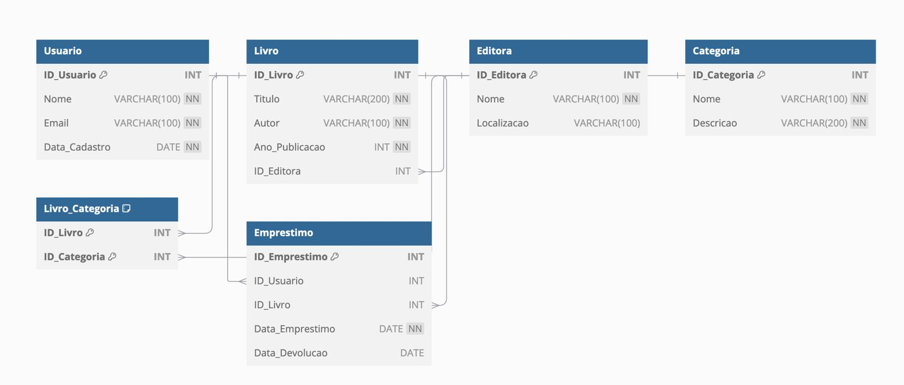
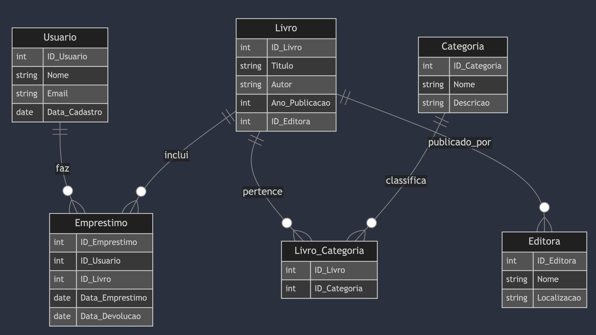

# Modelo Relacional

# Modelo Entidade-Relacional

# Criação das tabelas

Para a criação das tabelas, crie um banco de dados e execute o script Tabelas.sql

# Criação de Dados

## Instalação de dependências

O script utiliza uma biblioteca para geração de dados fictícios

`pip install Faker`

## Setup

Para conseguir rodar com exito, será necessario atualizar suas credencias no arquivo createData.py, dentro da função "conectar_banco"

## Execução

Para rodar o script, rode a seguinte linha de comando:

`python ./createData.py`

# Queries

Para executar as Queries, rode o arquivo queries.sql

# Alunos

Otávio Augusto Bragalha de Oliveira RA: 11.120.229-7

Victor Caetano RA: 11.120.428-5

Alisson Moriyasu Pinto RA: 11.120.044-0

